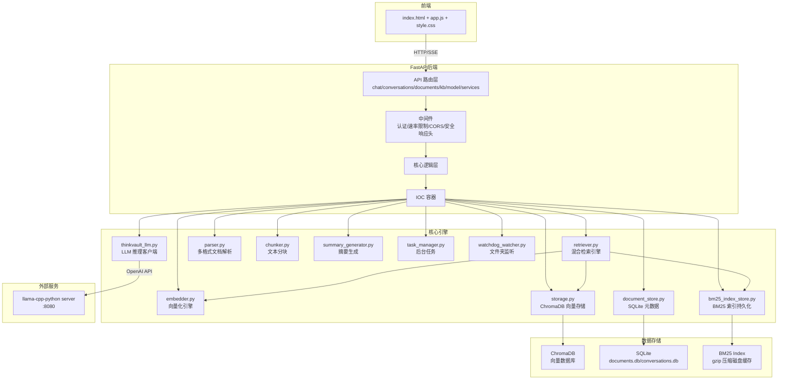
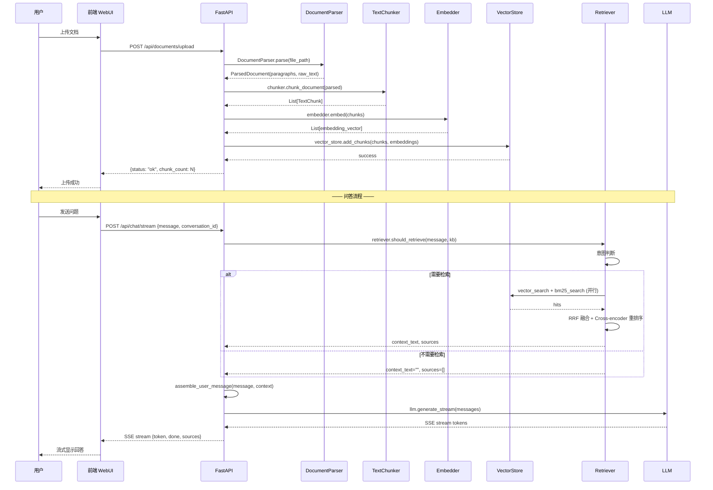

# ThinkVault

**个人 AI 工作台 —— 把本地文档变成可对话的私人图书馆**

ThinkVault 是一款运行在本地的 RAG（检索增强生成）知识库系统。支持 PDF、DOCX、PPTX、XLSX、TXT、Markdown、MP3、MP4 等 15+ 种文档格式，基于混合检索（向量语义检索 + BM25 关键词匹配 + RRF 融合 + Cross-encoder 重排序）实现精准文档召回，通过 OpenAI 兼容 API 对接 llama-cpp-python / Ollama 等本地推理后端，数据完全本地化，隐私无忧。

## 目录

- [核心特性](#核心特性)
- [系统要求](#系统要求)
- [快速开始](#快速开始)
- [安装](#安装)
- [API 文档](#api-文档)
- [环境变量](#环境变量)
- [项目架构](#项目架构)
- [支持的文档格式](#支持的文档格式)
- [Docker 部署](#docker-部署)
- [开发指南](#开发指南)
- [贡献指南](#贡献指南)
- [常见问题](#常见问题)
- [更新日志](#更新日志)

## 核心特性

| 特性 | 说明 |
|------|------|
| **全本地运行** | 数据零外传，对接 llama-cpp-python / Ollama / vLLM / LM Studio / 任意 OpenAI 兼容 API |
| **混合检索引擎** | 向量语义检索 + BM25 关键词匹配 + RRF 融合 + Cross-encoder 重排序，四级精排 |
| **15+ 文档格式** | PDF / DOCX / PPTX / XLSX / TXT / Markdown / MP3 / MP4 等，可选 OCR（扫描件）和 Whisper（音视频） |
| **增量索引** | 基于 content-hash 检测文件变更，仅处理新增/修改文件，避免全量重建索引 |
| **SSE 流式对话** | 逐 Token 流式输出，支持多会话管理、对话持久化和自动标题生成 |
| **文件夹监听** | watchdog 实时监听目录变更，自动触发增量索引 |
| **一键启动** | 内置服务管理器，自动扫描本地 GGUF 模型并启动 llama-cpp-python 推理后端 |
| **简洁 Web UI** | 内置单页前端，支持暗色/亮色主题切换，即开即用 |
| **安全加固** | SSRF/DNS rebinding 防护、速率限制（滑动窗口）、Bearer Token 认证、安全响应头、Docker 非 root 运行 |
| **性能优化** | ONNX Runtime 加速 Embedding、SQLite 连接池、BM25 索引持久化、Embedding 查询缓存 |

## 系统要求

| 项目 | 最低配置 | 推荐配置 |
|------|----------|----------|
| Python | 3.10+ | 3.11+ |
| 内存 | 8 GB | 16 GB+ |
| 存储 | 2 GB（模型 + 依赖） | 10 GB+（含文档数据和向量索引） |
| GPU | 不必须 | CUDA 12.1+ 可选加速推理和 Embedding |
| 推理后端 | llama-cpp-python server / Ollama / 任意 OpenAI 兼容 API |

## 快速开始

### 1. 安装依赖

```bash
pip install -e ".[local-embedding]"
```

### 2. 启动推理后端

```bash
# 方式一：使用 llama-cpp-python server
pip install 'llama-cpp-python[server]'
python -m llama_cpp.server \
  --model ~/.thinkvault/models/qwen2.5-0.5b-instruct-q4_k_m.gguf \
  --port 8080

# 方式二：使用 Ollama（推荐）
ollama run qwen2.5:0.5b
```

### 3. 启动 ThinkVault

```bash
thinkvault serve
```

### 4. 使用

打开浏览器访问 `http://localhost:8000`，上传文档后即可开始对话。

## 安装

### 克隆项目

```bash
git clone https://github.com/yourname/thinkvault.git
cd thinkvault
```

### 安装核心依赖

```bash
pip install -e .
```

### 可选扩展

```bash
# 本地 Embedding 模型（含 PyTorch，约 200MB，推荐）
pip install -e ".[local-embedding]"

# OCR 文档扫描件识别
pip install -e ".[ocr]"

# PPT / Excel 文档支持
pip install -e ".[ppt,excel]"

# 音视频转文字（需安装 ffmpeg）
pip install -e ".[media]"

# 开发依赖（测试 + 代码检查）
pip install -e ".[dev]"

# 一键安装全部可选功能
pip install -e ".[all]"
```

### 安装推理后端

ThinkVault 通过 OpenAI 兼容 API 与推理后端通信，支持以下后端：

#### 方式一：llama-cpp-python server（推荐用于本地 GPU 加速）

```bash
# CPU 版本
pip install 'llama-cpp-python[server]'

# GPU 加速版本（需 CUDA 12.1+）
CMAKE_ARGS="-DGGML_CUDA=on" pip install 'llama-cpp-python[server]'

# 启动服务
python -m llama_cpp.server \
  --model ~/.thinkvault/models/qwen2.5-0.5b-instruct-q4_k_m.gguf \
  --port 8080 \
  --n_ctx 2048
```

#### 方式二：Ollama（最简单）

```bash
# 安装 Ollama（参考 https://ollama.com/download）
ollama run qwen2.5:0.5b
```

#### 方式三：其他 OpenAI 兼容后端

- **vLLM**: `http://localhost:8000/v1`
- **LM Studio**: `http://localhost:1234/v1`
- **OpenAI API**: `https://api.openai.com/v1`（需设置 API Key）

### 下载 GGUF 模型

```bash
mkdir -p ~/.thinkvault/models
# 从 HuggingFace 下载，例如：
# https://huggingface.co/Qwen/Qwen2.5-0.5B-Instruct-GGUF
# https://huggingface.co/Qwen/Qwen2.5-1.5B-Instruct-GGUF
# https://huggingface.co/Qwen/Qwen2.5-7B-Instruct-GGUF
```

### 启动服务

```bash
# CLI 启动（推荐）
thinkvault serve

# 指定参数
thinkvault serve --host 127.0.0.1 --port 8000

# 模块方式启动
python -m thinkvault
```

## API 文档

### 认证

所有 API 请求需在请求头或查询参数中携带认证令牌：

```bash
# 请求头方式
curl -H "Authorization: Bearer your-token" http://localhost:8000/api/health

# 查询参数方式
curl http://localhost:8000/api/health?token=your-token
```

> 未设置 `THINKVAULT_API_TOKEN` 时，仅允许 localhost 访问。

### 聊天

| 方法 | 端点 | 说明 |
|------|------|------|
| POST | `/api/chat` | 非流式对话（推理后端不可用时降级为仅检索模式） |
| POST | `/api/chat/stream` | SSE 流式对话 |

**请求示例：**

```json
POST /api/chat
{
  "message": "文档中有关于 Python 的内容吗？",
  "knowledge_base": "default",
  "conversation_id": null,
  "system_prompt": null,
  "history": [],
  "stream": false
}
```

**响应示例：**

```json
{
  "answer": "是的，文档中提到 Python 是一种高级编程语言...",
  "sources": ["programming.md P1"],
  "conversation_id": "abc123",
  "mode": "chat",
  "stats": {"total_tokens": 150, "prompt_tokens": 100, "completion_tokens": 50}
}
```

### 文档管理

| 方法 | 端点 | 说明 |
|------|------|------|
| POST | `/api/documents/upload` | 上传文档（100MB 限制，支持指定知识库） |
| GET | `/api/documents` | 文档列表（分页，支持按知识库过滤） |
| GET | `/api/documents/{doc_id}/preview` | 文档预览（前 2000 字符） |
| DELETE | `/api/documents/{doc_id}` | 删除文档 |
| POST | `/api/documents/scan` | 扫描目录自动索引 |

**上传示例：**

```bash
curl -X POST http://localhost:8000/api/documents/upload \
  -F "file=@document.pdf" \
  -F "knowledge_base=default"
```

### 会话管理

| 方法 | 端点 | 说明 |
|------|------|------|
| GET | `/api/conversations` | 分页获取会话列表 |
| POST | `/api/conversations` | 创建会话 |
| DELETE | `/api/conversations` | 删除所有会话 |
| GET | `/api/conversations/{conv_id}` | 会话详情（含消息） |
| DELETE | `/api/conversations/{conv_id}` | 删除会话 |
| PATCH | `/api/conversations/{conv_id}` | 重命名会话 |
| GET | `/api/conversations/{conv_id}/messages` | 获取消息列表 |

### 知识库

| 方法 | 端点 | 说明 |
|------|------|------|
| GET | `/api/knowledge-bases` | 知识库列表 |
| POST | `/api/knowledge-bases` | 创建知识库 |
| DELETE | `/api/knowledge-bases/{name}` | 删除知识库及关联数据 |

### 知识库高级管理

| 方法 | 端点 | 说明 |
|------|------|------|
| POST | `/api/kb/manage/scan` | 增量扫描（后台异步） |
| POST | `/api/kb/manage/scan/sync` | 增量扫描（同步等待） |
| POST | `/api/kb/manage/reindex` | 重新索引单个文件 |
| POST | `/api/kb/manage/watch` | 添加文件夹监听 |
| DELETE | `/api/kb/manage/watch` | 移除文件夹监听 |
| GET | `/api/kb/manage/tasks` | 列出后台任务 |
| GET | `/api/kb/manage/tasks/{task_id}` | 查询任务状态 |
| POST | `/api/kb/manage/summaries` | 批量生成文档摘要（异步） |
| POST | `/api/kb/manage/summaries/sync` | 批量生成文档摘要（同步等待结果） |
| GET | `/api/kb/manage/{name}/changes` | 查看文件变更记录 |
| GET | `/api/kb/manage/{name}/summaries` | 查看文档摘要 |

### 模型与服务

| 方法 | 端点 | 说明 |
|------|------|------|
| GET | `/api/model` | 模型状态 |
| POST | `/api/model/load` | 探测推理后端可用性 |
| POST | `/api/model/unload` | 断开后端连接 |
| GET | `/api/model/list` | 扫描本地 + 远端可用模型 |
| GET | `/api/model/load/progress` | SSE 后端探测进度 |
| GET | `/api/hardware` | 硬件检测（CPU/RAM/GPU/推荐档位） |
| GET | `/api/health` | 健康检查 |
| GET | `/api/services/status` | 服务状态 |
| POST | `/api/services/start` | 一键启动本地推理服务 |
| POST | `/api/services/stop` | 停止所有本地服务 |
| GET | `/api/services/start/progress` | SSE 服务启动进度 |
| GET | `/api/services/models` | 列出本地 GGUF 模型 |

## 环境变量

### 基础配置

| 变量 | 默认值 | 说明 |
|------|--------|------|
| `THINKVAULT_API_TOKEN` | (空) | API 认证令牌。未设置时仅允许 localhost 访问 |
| `THINKVAULT_DISABLE_AUTH` | (空) | 设为 `1` 完全跳过认证（仅测试用） |
| `THINKVAULT_DATA_DIR` | `~/.thinkvault/data` | 数据存储根目录 |
| `THINKVAULT_CORS_ORIGINS` | `http://127.0.0.1:8000,http://localhost:8000` | CORS 白名单，逗号分隔 |
| `THINKVAULT_RATE_LIMIT` | `60` | 每窗口最大请求数 |
| `THINKVAULT_RATE_WINDOW` | `60` | 速率限制窗口（秒） |
| `THINKVAULT_LOG_LEVEL` | `WARNING` | 日志级别（DEBUG/INFO/WARNING/ERROR） |

### 推理后端

| 变量 | 默认值 | 说明 |
|------|--------|------|
| `THINKVAULT_LLM_URL` | `http://localhost:8080/v1` | 推理后端 API 地址 |
| `THINKVAULT_LLM_MODEL` | `default` | 推理后端模型名 |
| `THINKVAULT_LLM_API_KEY` | (空) | 推理后端 API Key |

### Embedding 模型

| 变量 | 默认值 | 说明 |
|------|--------|------|
| `THINKVAULT_USE_ONNX` | `1` | 使用 ONNX Runtime 加速（2-5x 提速） |
| `THINKVAULT_ONNX_QUANTIZED` | `0` | 使用量化 ONNX 模型 |
| `THINKVAULT_FP16` | `0` | 使用 FP16 推理 |
| `THINKVAULT_MODEL_DIR` | (空) | 自定义模型存储目录 |
| `THINKVAULT_EMBEDDING_API_URL` | (空) | 外部 Embedding API 地址 |
| `THINKVAULT_EMBEDDING_API_KEY` | (空) | 外部 Embedding API Key |
| `THINKVAULT_EMBEDDING_API_MODEL` | (空) | 外部 Embedding API 模型名 |
| `THINKVAULT_EMBEDDING_DIMENSION` | `512` | 外部 Embedding API 向量维度 |

### 检索引擎

| 变量 | 默认值 | 说明 |
|------|--------|------|
| `THINKVAULT_TOP_K` | `5` | 默认返回结果数 |
| `THINKVAULT_BM25_PERSIST` | `1` | 持久化 BM25 索引到磁盘 |
| `THINKVAULT_SKIP_RERANK` | (空) | 设为 `1` 跳过 Cross-encoder 重排序 |
| `THINKVAULT_RERANK_MIN_CANDIDATES` | `3` | Cross-encoder 重排序的候选数阈值（低于此值时跳过重排序） |
| `THINKVAULT_CROSS_ENCODER` | (空) | 自定义 Cross-encoder 模型路径 |
| `THINKVAULT_INTENT_THRESHOLD` | `0.3` | 意图判断相似度阈值 |
| `THINKVAULT_HIERARCHICAL_THRESHOLD` | `5000` | 大规模知识库自动切换分层检索的 chunk 数阈值（0 表示禁用） |
| `THINKVAULT_MIN_RELEVANCE_DISTANCE` | `1.5` | 检索结果最低相关性距离阈值 |
| `THINKVAULT_EMBED_CACHE_SIZE` | `128` | 嵌入缓存最大条目数 |
| `THINKVAULT_EMBED_CACHE_TTL` | `300` | 嵌入缓存 TTL（秒） |
| `THINKVAULT_INTENT_KEYWORDS` | (空) | 自定义意图关键词库文件路径 |

### 向量数据库

| 变量 | 默认值 | 说明 |
|------|--------|------|
| `THINKVAULT_HNSW_EF_CONSTRUCT` | `200` | HNSW 构建参数 |
| `THINKVAULT_HNSW_M` | `32` | HNSW 连接数参数 |
| `THINKVAULT_HNSW_EF_SEARCH` | `100` | HNSW 查询参数 |

### 文档解析

| 变量 | 默认值 | 说明 |
|------|--------|------|
| `THINKVAULT_DOCX_TIMEOUT` | `5` | DOCX 锁等待超时（秒） |
| `THINKVAULT_OCR_MAX_PAGES` | `10` | OCR 最大并发页数 |
| `THINKVAULT_WHISPER_MODEL` | `base` | Whisper 模型大小 |
| `THINKVAULT_WHISPER_DEVICE` | `cpu` | Whisper 推理设备 |
| `THINKVAULT_WHISPER_COMPUTE_TYPE` | `int8` | Whisper 计算精度 |
| `THINKVAULT_SCAN_DIRS` | (空) | 额外允许扫描的目录（逗号分隔） |

## 项目架构

### 系统架构图



### 模块结构

```
thinkvault/
├── api/                          # FastAPI 接口层
│   ├── server.py                 # 服务入口（中间件 + 生命周期）
│   ├── routes/                   # 路由定义
│   │   ├── chat.py               # 聊天端点（SSE 流式 + 非流式）
│   │   ├── conversations.py      # 会话管理（CRUD + 消息）
│   │   ├── documents.py          # 文档管理（上传/列表/删除/预览）
│   │   ├── kb.py                 # 知识库基础操作（列表/创建/删除）
│   │   ├── kb_manage.py          # 知识库高级管理（扫描/监听/任务）
│   │   ├── model.py              # 模型管理（状态/加载/卸载）
│   │   └── services.py           # 服务管理（启动/停止/状态）
│   └── schemas/                  # Pydantic 数据模型
├── core/                         # 核心引擎
│   ├── base_store.py             # Store 基类（惰性初始化 + 线程安全）
│   ├── bm25_index_store.py       # BM25 索引持久化（gzip 压缩）
│   ├── chunker.py                # 文本分块器（固定窗口 + 重叠）
│   ├── container.py              # 依赖注入容器（IOC）
│   ├── conversation_store.py     # 对话持久化存储
│   ├── db.py                     # SQLite 连接管理（线程安全 + 连接池）
│   ├── doc_summary_store.py      # 文档摘要存储
│   ├── document_store.py         # 文档元数据存储
│   ├── embedder.py               # 向量化引擎（ONNX / PyTorch / API）
│   ├── file_change_store.py      # 文件变更记录存储
│   ├── incremental_indexer.py    # 增量索引引擎（content-hash 检测）
│   ├── indexer.py                # 文档索引统一入口
│   ├── parser.py                 # 多格式文档解析器（15+ 格式）
│   ├── retriever.py              # 检索引擎（向量 + BM25 + Rerank）
│   ├── scanner.py                # 文件夹扫描器
│   ├── service_manager.py        # 本地服务管理器（子进程生命周期）
│   ├── storage.py                # 向量存储（ChromaDB HNSW）
│   ├── summary_generator.py      # 文档摘要生成器
│   ├── task_manager.py           # 后台任务队列
│   ├── thinkvault_llm.py         # LLM 集成（OpenAI 兼容 API）
│   ├── watchdog_watcher.py       # 文件夹实时监听
│   └── watched_dir_store.py      # 监听目录配置存储
├── webui/                        # 前端（纯静态，无构建工具）
│   ├── index.html                # 单页应用入口
│   ├── style.css                 # 样式文件
│   ├── app.js                    # 前端逻辑
│   └── vendor/                   # 第三方库（marked / DOMPurify）
├── utils/                        # 工具模块
│   ├── hardware.py               # 硬件检测（CPU/RAM/GPU）
│   ├── logger.py                 # 日志管理
│   └── security.py               # SSRF/DNS rebinding 防护
├── data/                         # 内置数据
│   └── intent_keywords.json      # 意图关键词库
├── cli.py                        # 命令行入口
└── launch.py                     # 启动脚本
```

### 数据流（文档上传 → 问答）



## 支持的文档格式

| 格式 | 扩展名 | 最低依赖 | 可选依赖 |
|------|--------|----------|----------|
| PDF | `.pdf` | pymupdf | PaddleOCR / RapidOCR（扫描件） |
| Word | `.docx` | python-docx | |
| PowerPoint | `.pptx` | | python-pptx |
| Excel | `.xlsx` `.xlsm` | | openpyxl |
| 纯文本 | `.txt` | 内置 | |
| Markdown | `.md` `.markdown` | 内置 | |
| 音频 | `.mp3` `.wav` `.m4a` `.flac` `.ogg` | | faster-whisper + ffmpeg |
| 视频 | `.mp4` `.mkv` `.avi` `.mov` `.webm` | | faster-whisper + ffmpeg |

## Docker 部署

### 前置要求

- [Docker](https://docs.docker.com/get-docker/) 20.10+
- [Docker Compose](https://docs.docker.com/compose/install/) 2.0+
- 已下载 GGUF 模型文件

### 一键启动

```bash
mkdir -p ./models
# 将 GGUF 模型文件放入 ./models/

docker-compose up -d
docker-compose logs -f
```

浏览器访问 `http://localhost:8000`。

### 生产环境配置

在 `docker-compose.yml` 或 `.env` 中设置以下变量：

```yaml
environment:
  THINKVAULT_API_TOKEN: "your-secure-token-here"  # 必须设置
  THINKVAULT_LLM_URL: "http://llama-cpp:8080/v1"
  THINKVAULT_DATA_DIR: "/data"
```

## 开发指南

### 开发环境设置

```bash
# 安装开发依赖
pip install -e ".[dev]"

# 运行测试
python -m pytest test/ -v

# 运行特定测试
python -m pytest test/test_api_integration.py -v

# 代码质量检查
pre-commit run --all-files

# 类型检查
python -m mypy thinkvault/core/ --ignore-missing-imports
```

### 代码规范

- **代码风格**: 使用 Black 自动格式化（`black thinkvault/`）
- **代码检查**: 使用 Flake8（`flake8 thinkvault/`）
- **类型注解**: 所有函数参数、返回值、类属性需添加类型注解
- **测试要求**: 新增功能需添加单元测试，测试覆盖率目标 ≥ 30%

### 提交规范

```
<类型>(<模块>): <描述>

<详细说明>

<关联问题/PR>
```

类型：
- `feat`: 新功能
- `fix`: Bug 修复
- `docs`: 文档更新
- `style`: 代码风格（不影响功能）
- `refactor`: 重构
- `test`: 测试相关
- `chore`: 构建/工具相关

## 贡献指南

### 提交代码流程

1. **Fork 项目仓库**：在 GitHub 上点击 Fork 按钮创建自己的分支
2. **克隆仓库**：`git clone https://github.com/yourname/thinkvault.git`
3. **创建特性分支**：`git checkout -b feature/your-feature` 或 `fix/issue-number`
4. **编写代码**：遵循项目代码规范，添加必要的类型注解
5. **添加测试**：为新功能或修复添加单元测试
6. **运行测试**：`python -m pytest test/ -v`
7. **代码质量检查**：`pre-commit run --all-files`
8. **提交代码**：使用规范的提交信息格式
9. **创建 Pull Request**：描述变更内容、测试结果和相关问题

### 代码规范

- **代码风格**: 使用 Black 自动格式化（`black thinkvault/`）
- **代码检查**: 使用 Flake8（`flake8 thinkvault/`）
- **类型注解**: 所有函数参数、返回值、类属性需添加类型注解
- **测试要求**: 新增功能需添加单元测试，测试覆盖率目标 ≥ 30%

### 提交信息规范

```
<类型>(<模块>): <简短描述>

<详细说明，包含变更原因和影响>

<关联问题编号或 PR 链接>
```

**类型说明**:
- `feat`: 新功能
- `fix`: Bug 修复
- `docs`: 文档更新
- `style`: 代码风格（不影响功能）
- `refactor`: 重构
- `test`: 测试相关
- `chore`: 构建/工具相关

### 开发建议

- 优先使用项目已有的工具和模式
- 保持代码简洁，避免过度设计
- 遵循 DRY（Don't Repeat Yourself）原则
- 编写清晰的函数和变量命名
- 添加适当的注释解释复杂逻辑

## 常见问题

### Q: 首次启动很慢？

首次启动需要下载 Embedding 模型（约 100MB）和构建 BM25 索引。后续启动会从磁盘缓存加载，速度显著提升。可通过设置 `THINKVAULT_EMBEDDING_API_URL` 使用外部 Embedding API 跳过本地模型加载。

### Q: ChromaDB 在 Windows 上报权限错误？

设置 `THINKVAULT_DATA_DIR` 指向有写入权限的目录：

```bash
set THINKVAULT_DATA_DIR=D:\thinkvault_data
thinkvault serve
```

### Q: Cross-encoder 模型下载失败？

首次使用会从 HuggingFace 下载 `cross-encoder/ms-marco-MiniLM-L-6-v2`（约 80MB）。如果网络受限：

1. 手动下载模型到本地
2. 设置 `THINKVAULT_CROSS_ENCODER=/path/to/local/model`
3. 或设置 `THINKVAULT_SKIP_RERANK=1` 跳过重排序

### Q: 如何确认服务正常运行？

```bash
curl http://localhost:8000/api/health
# 返回: {"status":"ok","version":"2.0.0",...}
```

### Q: 如何重置所有数据？

```bash
# 停止服务后删除数据目录
rm -rf ~/.thinkvault/data

# Docker 环境
docker-compose down -v
```

### Q: 内存占用过高？

- 使用更小的 GGUF 模型（如 Q4_K_M 量化版本）
- 设置 `THINKVAULT_SKIP_RERANK=1` 跳过 Cross-encoder
- 使用外部 Embedding API 减少本地内存占用
- 减小 `THINKVAULT_TOP_K` 值

### Q: 如何使用外部 LLM（如 Ollama / OpenAI）？

```bash
# Ollama
set THINKVAULT_LLM_URL=http://localhost:11434/v1

# OpenAI 兼容 API
set THINKVAULT_LLM_URL=https://api.openai.com/v1
set THINKVAULT_LLM_API_KEY=sk-xxx
```

### Q: 文档上传失败或解析错误？

- 检查文件大小是否超过 100MB 限制
- 检查文件格式是否在支持列表中
- 确保安装了对应的可选依赖（如 python-pptx 用于 PPTX，openpyxl 用于 XLSX）
- 对于扫描件 PDF，需要安装 OCR 依赖：`pip install -e ".[ocr]"`

### Q: 检索结果不准确？

- 尝试增大 `THINKVAULT_TOP_K` 值（默认 5）
- 检查 Embedding 模型是否正确加载
- 确保文档已正确索引（查看 `/api/documents` 返回的文档状态）
- 调整 `THINKVAULT_INTENT_THRESHOLD` 意图判断阈值

### Q: 服务无法启动或端口被占用？

```bash
# 检查端口占用
netstat -ano | findstr :8000

# 指定其他端口启动
thinkvault serve --port 8081
```

### Q: Docker 部署后无法访问？

- 确保 `THINKVAULT_API_TOKEN` 已正确设置
- 检查容器日志：`docker-compose logs -f`
- 确认端口映射正确（默认 8000 端口）
- 生产环境建议绑定 `127.0.0.1` 而非 `0.0.0.0`

### Q: 如何备份数据？

```bash
# 备份数据目录
cp -r ~/.thinkvault/data ~/.thinkvault/data_backup

# Docker 环境（停止服务后）
docker-compose cp thinkvault:/data ./backup
```

## 更新日志

### v2.0.0 — 架构重构与性能优化

**架构重构**
- API 路由拆分为独立模块（chat / conversations / documents / kb / kb_manage / model / services）
- Retriever 分解为 Mixin 架构（`_BM25Mixin` / `_IntentMixin` / `_ContextMixin`）
- Store 模块提取 `BaseStore` 基类，消除重复初始化代码
- 新增 `indexer.py` 统一文档索引入口
- Pydantic v2 响应模型，OpenAPI 文档自动生成

**性能优化**
- BM25 引擎从 `rank_bm25` 升级为 `bm25s`（C 扩展，10-50x 加速）
- 向量检索 + BM25 并行执行（`ThreadPoolExecutor`）
- BM25 索引 gzip 持久化，冷启动从 13s 降至 1-3s
- ONNX Runtime 三后端架构（ONNX → PyTorch → API）
- Embedding 查询缓存（LRU + TTL），避免重复向量化
- SQLite 连接池优化，高并发场景性能提升

**安全加固**
- SSRF 防护（IP 验证 + 云元数据地址拦截 + RFC1918 网段过滤）
- XSS 修复（`escAttr()` 属性转义）
- Docker 非 root 用户运行
- 安全响应头（X-Content-Type-Options / X-Frame-Options / Referrer-Policy）
- 速率限制中间件（滑动窗口算法）

**稳定性修复**
- `threading.Lock` → `RLock`，修复容器工厂函数嵌套调用死锁
- 数据库连接泄漏修复（`try/finally` 确保关闭）
- 服务管理器文件句柄泄漏修复
- 大文件保护（100MB 限制）

**新增功能**
- 知识库高级管理 API（增量扫描 / 文件夹监听 / 文档摘要 / 后台任务）
- 一键启动推理服务（自动发现 GGUF 模型 → 启动 llama-cpp-python → 连接后端）
- 分页查询（文档列表 / 会话列表）
- 异步文档上传（`asyncio.to_thread`）

### v1.0.0 — 初始版本

- 基础 RAG 流水线（文档解析 → 分块 → 向量化 → 检索 → 生成）
- PDF / DOCX / TXT 文档支持
- BM25 + 向量混合检索
- SSE 流式对话
- Web UI
- SQLite 数据持久化

## License

MIT License