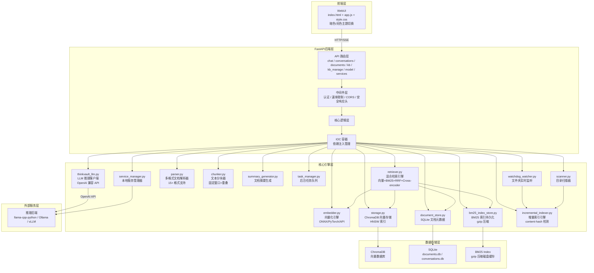
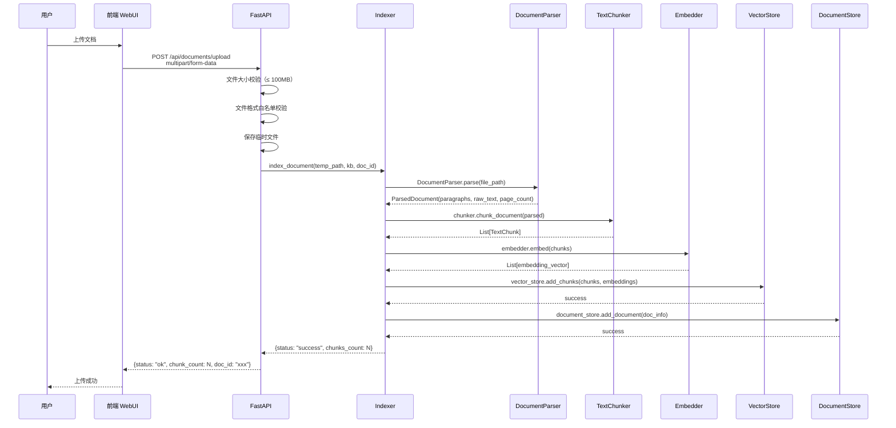
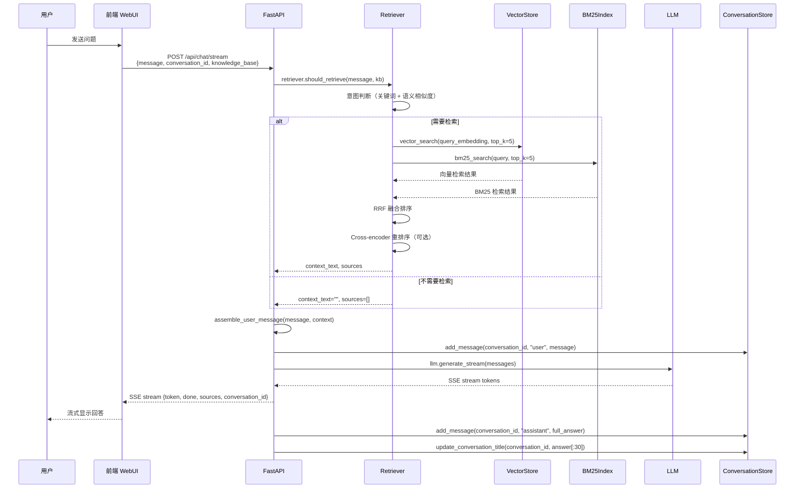
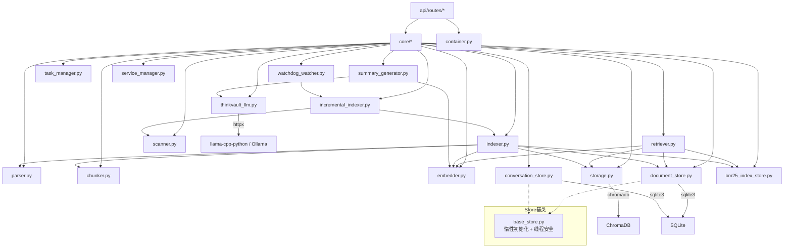
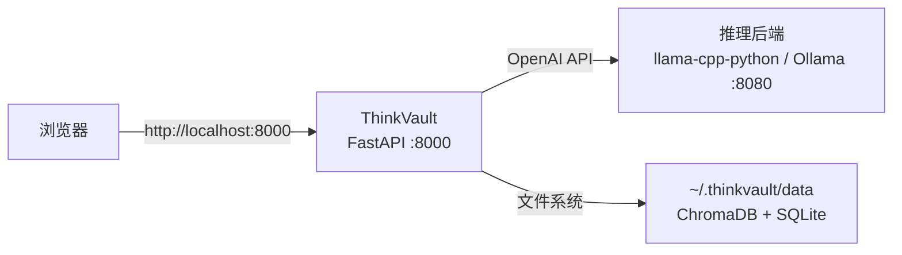

# ThinkVault 项目架构文档

> 生成时间：2026-06-22  
> 版本：v2.0.0

---

## 1. 系统架构总览



---

## 2. 数据流图（文档上传 → 检索 → 问答）

### 文档上传流程



### 问答流程



---

## 3. 检索架构（混合检索）

```mermaid
graph LR
    subgraph 输入层
        Q[用户问题]
        KB[知识库名称]
    end

    subgraph 意图判断层
        Intent{should_retrieve?}
        IntentKeywords[关键词匹配<br/>intent_keywords.json]
        IntentEmbedding[语义相似度<br/>与检索意图向量比较]
    end

    subgraph 检索层
        VecSearch[向量检索<br/>ChromaDB HNSW ANN]
        BM25Search[BM25 检索<br/>bm25s C 扩展引擎]
        RRFFuse[RRF 融合排序<br/>Reciprocal Rank Fusion]
    end

    subgraph 后处理层
        Rerank[Cross-Encoder 重排序<br/>可选，可通过 SKIP_RERANK 跳过]
        Format[format_context<br/>截断 + 来源标注 + 去重]
        Cache[Embedding 缓存<br/>LRU + TTL]
    end

    subgraph 输出层
        Context[上下文文本]
        Sources[来源文件列表<br/>{file_name, chunk_index, page}]
    end

    Q --> IntentKeywords
    Q --> IntentEmbedding
    IntentKeywords --> Intent
    IntentEmbedding --> Intent
    Intent -->|是| VecSearch
    Intent -->|是| BM25Search
    VecSearch --> RRFFuse
    BM25Search --> RRFFuse
    RRFFuse --> Rerank
    Rerank --> Format
    Format --> Context
    Format --> Sources
    Intent -->|否| Context
    Q -.-> Cache
    Cache -.-> VecSearch
```

---

## 4. 模块依赖关系



---

## 5. 数据库 Schema

### ChromaDB（向量存储）

```
Collection: {kb_name}
  - ids: List[str]                    # chunk_id
  - embeddings: List[List[float]]  # 1024 维
  - metadatas: List[dict]            # {source_file, source_page, chunk_index, doc_id}
  - documents: List[str]             # chunk 文本
```

### SQLite（文档元数据）

```sql
TABLE documents (
    id              TEXT PRIMARY KEY,
    file_name       TEXT NOT NULL,
    file_type       TEXT NOT NULL,
    file_size       INTEGER NOT NULL,
    knowledge_base  TEXT NOT NULL DEFAULT 'default',
    chunk_count     INTEGER NOT NULL DEFAULT 0,
    upload_time     TEXT NOT NULL,
    status          TEXT NOT NULL DEFAULT 'indexed',
    preview         TEXT,
    page_count      INTEGER,
    tags            TEXT DEFAULT '',
    file_path       TEXT DEFAULT '',
    content_hash    TEXT DEFAULT '',
    mtime           REAL DEFAULT 0
)

TABLE doc_summaries (
    id              TEXT PRIMARY KEY,
    doc_id          TEXT NOT NULL,
    knowledge_base  TEXT NOT NULL,
    summary         TEXT,
    model           TEXT,
    status          TEXT DEFAULT 'pending',
    summary_embedding TEXT,          -- JSON 编码的向量
    created_at      TEXT NOT NULL
)

TABLE conversations (
    id          TEXT PRIMARY KEY,
    title       TEXT NOT NULL DEFAULT 'New Chat',
    created_at  TEXT NOT NULL,
    updated_at  TEXT NOT NULL
)

TABLE messages (
    id          TEXT PRIMARY KEY,
    conv_id     TEXT NOT NULL,
    role        TEXT NOT NULL CHECK(role IN ('user', 'assistant', 'system')),
    content     TEXT NOT NULL,
    created_at  TEXT NOT NULL,
    sources     TEXT DEFAULT '[]',
    mode        TEXT DEFAULT 'chat'
)

TABLE file_changes (
    id              TEXT PRIMARY KEY,
    knowledge_base  TEXT NOT NULL,
    file_path       TEXT NOT NULL,
    change_type     TEXT NOT NULL,
    hash            TEXT,
    created_at      TEXT NOT NULL
)

TABLE watched_dirs (
    id              TEXT PRIMARY KEY,
    knowledge_base  TEXT NOT NULL,
    directory_path  TEXT NOT NULL,
    enabled         INTEGER DEFAULT 1,
    created_at      TEXT NOT NULL
)
```

### BM25 索引持久化（磁盘）

```
~/.thinkvault/bm25_indexes/{kb}.json.gz
{
  "version": 1,
  "chunk_count": 50000,
  "created_at": "2026-06-22T00:00:00",
  "corpus": ["chunk text 1", "chunk text 2", ...],
  "doc_ids": ["doc_xxx", "doc_yyy", ...],
  "doc_texts": ["full doc text 1", ...],
  "doc_metadatas": [{"source_file": "...", "source_page": 1}, ...]
}
```

---

## 6. 配置参数一览

| 环境变量 | 默认值 | 说明 |
|------------|---------|------|
| `THINKVAULT_LLM_URL` | `http://localhost:8080/v1` | LLM 后端地址 |
| `THINKVAULT_LLM_MODEL` | `default` | 模型名称 |
| `THINKVAULT_API_TOKEN` |（空，仅允许 localhost） | API 认证 Token |
| `THINKVAULT_SKIP_RERANK` | `""` (false) | 跳过 Cross-encoder 重排序 |
| `THINKVAULT_TOP_K` | `5` | 默认检索 top_k |
| `THINKVAULT_BM25_PERSIST` | `1` (true) | BM25 索引持久化 |
| `THINKVAULT_INTENT_THRESHOLD` | `0.3` | 意图判断相似度阈值 |
| `THINKVAULT_MIN_RELEVANCE_DISTANCE` | `1.5` | 检索结果最低相关性阈值 |
| `THINKVAULT_DATA_DIR` | `~/.thinkvault/data` | 数据存储根目录 |
| `THINKVAULT_EMBED_CACHE_SIZE` | `128` | 嵌入缓存最大条目数 |
| `THINKVAULT_EMBED_CACHE_TTL` | `300` | 嵌入缓存 TTL（秒） |

---

## 7. 性能优化要点

| 优化项 | 方法 | 效果 |
|--------|------|------|
| BM25 冷启动 | 三级缓存（内存 → 磁盘 → 重建） | 18-53s → 1-3s |
| 检索响应 | 跳过重排序 + top_k=3 | ~2s → ~0.5s |
| BM25 引擎 | `rank_bm25` → `bm25s`（C 扩展） | 10-50x 加速 |
| 检索并行 | 向量 + BM25 并行执行 | 串行和 → 并行最大值 |
| SQLite 连接 | 连接池模式（CPU × 2 连接数） | 高并发性能提升 |
| Embedding 缓存 | LRU + TTL 缓存 | 避免重复向量化 |
| SSE 流式 | 首 token 立即返回 | 感知延迟大幅降低 |

---

## 8. 安全机制

```
┌────────────────────────────────────────────────────┐
│  API 层                                           │
│  ┌────────────┐    ┌────────────┐                 │
│  │ Token 认证 │    │ 速率限制   │                 │
│  │ Bearer     │    │ 滑动窗口   │                 │
│  │ ?token=    │    │ IP 维度    │                 │
│  └────────────┘    └────────────┘                 │
│  ┌────────────┐    ┌────────────┐                 │
│  │ CORS 白名单│    │ 路径安全检查│                 │
│  │ 防跨域     │    │ 防遍历     │                 │
│  └────────────┘    └────────────┘                 │
├────────────────────────────────────────────────────┤
│  输入层                                            │
│  ┌────────────┐    ┌────────────┐                 │
│  │ 文件类型   │    │ 文件大小   │                 │
│  │ 白名单     │    │ ≤ 100 MB   │                 │
│  └────────────┘    └────────────┘                 │
│  ┌────────────┐    ┌────────────┐                 │
│  │ 文件名长度 │    │ XSS 防护   │                 │
│  │ ≤ 255      │    │ sanitize   │                 │
│  └────────────┘    └────────────┘                 │
├────────────────────────────────────────────────────┤
│  输出层                                            │
│  ┌────────────┐    ┌────────────┐                 │
│  │ SSRF 防护  │    │ 安全响应头 │                 │
│  │ IP 白名单  │    │ CSP/HSTS   │                 │
│  └────────────┘    └────────────┘                 │
└────────────────────────────────────────────────────┘
```

### SSRF 防护

| 防护措施 | 实现位置 |
|----------|----------|
| IP 地址验证（私有 IP / 回环地址） | `utils/security.py` |
| 云元数据地址拦截（AWS/Azure/GCP） | `utils/security.py` |
| RFC1918 网段过滤 | `utils/security.py` |
| DNS 解析后 IP 锁定（防 DNS rebinding） | `utils/security.py` |

---

## 9. 项目文件结构

```
ThinkVault/
├── thinkvault/
│   ├── api/
│   │   ├── server.py               # 服务入口（中间件 + 生命周期）
│   │   ├── routes/
│   │   │   ├── chat.py             # 聊天接口（SSE 流式 + 非流式）
│   │   │   ├── conversations.py    # 会话管理（CRUD + 消息）
│   │   │   ├── documents.py        # 文档上传/删除/列表/预览
│   │   │   ├── kb.py               # 知识库基础操作
│   │   │   ├── kb_manage.py        # 知识库高级管理（扫描/监听/任务）
│   │   │   ├── model.py            # 模型状态管理
│   │   │   └── services.py         # 服务管理（启动/停止）
│   │   └── schemas/                # Pydantic 数据模型
│   ├── core/
│   │   ├── thinkvault_llm.py       # LLM 客户端（httpx + SSE）
│   │   ├── retriever.py            # 混合检索（BM25+Vector+Rerank）
│   │   ├── parser.py               # 多格式文档解析（15+ 格式）
│   │   ├── chunker.py              # 文本分块（固定窗口 + 重叠）
│   │   ├── embedder.py             # 向量化引擎（ONNX/PyTorch/API）
│   │   ├── storage.py              # ChromaDB 向量存储
│   │   ├── document_store.py       # SQLite 文档元数据
│   │   ├── summary_generator.py    # 文档摘要生成
│   │   ├── bm25_index_store.py     # BM25 索引持久化（gzip）
│   │   ├── container.py            # IOC 容器
│   │   ├── base_store.py           # Store 基类（惰性初始化 + 线程安全）
│   │   ├── db.py                   # SQLite 连接管理（线程安全 + 连接池）
│   │   ├── indexer.py              # 文档索引统一入口
│   │   ├── incremental_indexer.py  # 增量索引引擎（content-hash）
│   │   ├── scanner.py              # 目录扫描
│   │   ├── task_manager.py         # 后台任务队列
│   │   ├── watchdog_watcher.py     # 文件夹实时监听
│   │   ├── service_manager.py      # 本地服务管理器
│   │   └── *store.py               # 各类 SQLite 存储模块
│   ├── webui/
│   │   ├── index.html              # SPA 前端
│   │   ├── style.css
│   │   ├── app.js
│   │   └── vendor/                 # 第三方库（marked / DOMPurify）
│   ├── utils/
│   │   ├── hardware.py             # 硬件检测
│   │   ├── logger.py               # 日志管理
│   │   └── security.py             # SSRF/DNS rebinding 防护
│   ├── data/
│   │   └── intent_keywords.json    # 意图关键词库
│   ├── cli.py                      # 命令行入口
│   └── launch.py                   # 启动脚本
├── test/                           # 单元测试 + 集成测试
├── scripts/                        # 辅助脚本
├── docs/                           # 技术文档
├── Dockerfile
├── docker-compose.yml
├── pyproject.toml
├── requirements.txt
└── README.md
```

---

## 10. 部署架构

### 本地开发部署



### Docker 容器化部署

```mermaid
graph LR
    Client[浏览器] -->|http://localhost:8000| Proxy[反向代理<br/>可选]
    Proxy -->|http://localhost:8000| TV[ThinkVault<br/>Docker Container :8000]
    TV -->|http://llama-cpp:8080/v1| LLM[llama-cpp-python<br/>Docker Container :8080]
    TV -->|文件挂载| DataDir[/data<br/>ChromaDB + SQLite]
    LLM -->|文件挂载| ModelDir[/models<br/>GGUF 模型文件]
```

### 启动命令

```bash
# 方式一：本地启动（推荐开发环境）
# 1. 启动 LLM 后端
python -m llama_cpp.server \
    --model ~/.thinkvault/models/qwen2.5-0.5b-instruct-q4_k_m.gguf \
    --port 8080 \
    --n_ctx 2048

# 2. 启动 ThinkVault
thinkvault serve --host 127.0.0.1 --port 8000

# 方式二：Docker 启动（推荐生产环境）
mkdir -p ./models
# 将 GGUF 模型文件放入 ./models/
docker-compose up -d
```

---

## 11. 技术栈

| 类别 | 技术 | 版本 | 用途 |
|------|------|------|------|
| 语言 | Python | 3.10+ | 核心后端开发 |
| Web 框架 | FastAPI | 0.115+ | RESTful API、SSE 流式响应、OpenAPI 文档 |
| 异步 HTTP | httpx | 0.27+ | 与 LLM 后端通信、SSE 流式处理 |
| WSGI 服务器 | uvicorn | 0.30+ | ASGI 服务器 |
| 数据库 | SQLite | 内置 | 文档元数据、会话记录、文件变更记录 |
| 向量数据库 | ChromaDB | 0.5+ | 向量存储、HNSW 索引、相似性搜索 |
| ORM/序列化 | Pydantic | 2.0+ | API 请求/响应验证、数据模型定义 |
| 文档解析 | PyMuPDF | 1.24+ | PDF 文档解析 |
| 文档解析 | python-docx | 1.1+ | DOCX 文档解析 |
| 文档解析 | python-pptx | 0.6+ | PPTX 文档解析（可选） |
| 文档解析 | openpyxl | 3.1+ | XLSX 文档解析（可选） |
| OCR | rapidocr-onnxruntime | 1.3+ | 扫描件 PDF 文字识别（可选） |
| 音视频转写 | faster-whisper | 1.0+ | MP3/MP4 转文字（可选） |
| 向量化 | sentence-transformers | 3.0+ | 本地 Embedding 模型（可选） |
| 向量化 | ONNX Runtime | - | Embedding 推理加速（2-5x） |
| 检索 | bm25s | - | BM25 关键词检索（C 扩展，10-50x 加速） |
| 检索 | ChromaDB HNSW | - | 向量近似最近邻搜索 |
| 重排序 | cross-encoder | - | Cross-encoder 精排（可选） |
| 文件监听 | watchdog | 4.0+ | 目录实时监控 |
| 硬件检测 | psutil | 5.9+ | CPU/RAM/GPU 信息检测 |
| 前端 | 原生 HTML/CSS/JS | - | 单页应用、暗色/亮色主题 |
| 前端库 | marked | - | Markdown 渲染 |
| 前端库 | DOMPurify | - | HTML 内容安全过滤 |
| 测试 | pytest | 8.0+ | 单元测试、集成测试 |
| 代码质量 | Black | - | 代码格式化 |
| 代码质量 | Flake8 | - | 代码检查 |
| 代码质量 | mypy | - | 静态类型检查 |

---

## 12. 安全机制详解

### 认证与授权

| 机制 | 实现方式 | 说明 |
|------|----------|------|
| Bearer Token | 请求头 `Authorization: Bearer xxx` | API 认证令牌 |
| 查询参数 Token | URL 参数 `?token=xxx` | 备用认证方式 |
| 本地访问白名单 | 未设置 Token 时仅允许 localhost | 开发环境便利 |
| 完全跳过认证 | `THINKVAULT_DISABLE_AUTH=1` | 仅测试用 |

### 输入验证

| 验证项 | 规则 | 处理方式 |
|--------|------|----------|
| 文件类型 | 白名单（PDF/DOCX/PPTX/XLSX/TXT/MD 等） | 拒绝非法格式 |
| 文件大小 | ≤ 100MB | 返回 413 错误 |
| 文件名长度 | ≤ 255 字符 | 截断或拒绝 |
| 目录路径 | `THINKVAULT_SCAN_DIRS` 白名单 | 拒绝非法路径 |
| URL 地址 | SSRF 防护（IP/协议/云元数据拦截） | 拒绝危险地址 |

### 速率限制

| 参数 | 默认值 | 说明 |
|------|--------|------|
| `THINKVAULT_RATE_LIMIT` | 60 | 每窗口最大请求数 |
| `THINKVAULT_RATE_WINDOW` | 60 | 速率限制窗口（秒） |

### 安全响应头

| 响应头 | 值 | 作用 |
|--------|------|------|
| X-Content-Type-Options | nosniff | 防止 MIME 类型嗅探 |
| X-Frame-Options | DENY | 防止点击劫持 |
| Referrer-Policy | same-origin | 控制 Referrer 发送 |
| Content-Security-Policy | default-src 'self' | 防止 XSS |

### SSRF/DNS Rebinding 防护

| 防护措施 | 实现位置 | 说明 |
|----------|----------|------|
| IP 地址验证 | `utils/security.py` | 过滤私有 IP、回环地址 |
| 云元数据拦截 | `utils/security.py` | 拦截 AWS/Azure/GCP 元数据地址 |
| RFC1918 网段过滤 | `utils/security.py` | 过滤 10.x.x.x、172.16-31.x.x、192.168.x.x |
| DNS 解析后 IP 锁定 | `utils/security.py` | 防止 DNS rebinding 攻击 |
| 协议白名单 | `utils/security.py` | 仅允许 http/https |

---

*文档由 ThinkVault Team 生成 · 2026-06-22*